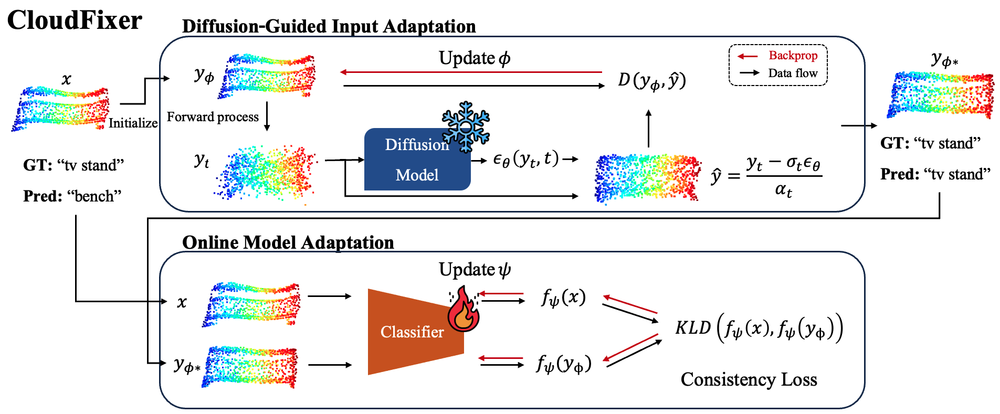

# CloudFixer: Test-Time Adaptation for 3D Point Clouds via Diffusion-Guided Geometric Transformation (ECCV 2024)
[](https://arxiv.org/abs/2407.16193)


## Introduction
[**CloudFixer: Test-Time Adaptation for 3D Point Clouds via Diffusion-Guided Geometric Transformation**](https://arxiv.org/abs/2407.16193)<br>
Hajin Shim*, Changhun Kim* and Eunho Yang (*: equal contribution)<br>
European Conference on Computer Vision (**ECCV**), 2024



<div style="text-align: justify;">
<b>Abstract:</b> 3D point clouds captured from real-world sensors frequently encompass noisy points due to various obstacles, such as occlusion, limited resolution, and variations in scale. These challenges hinder the deployment of pre-trained point cloud recognition models trained on clean point clouds, leading to significant performance degradation. While test-time adaptation (TTA) strategies have shown promising results on this issue in the 2D domain, their application to 3D point clouds remains under-explored. Among TTA methods, an input adaptation approach, which directly converts test instances to the source domain using a pre-trained diffusion model, has been proposed in the 2D domain. Despite its robust TTA performance in practical situations, naively adopting this into the 3D domain may be suboptimal due to the neglect of inherent properties of point clouds, and its prohibitive computational cost. Motivated by these limitations, we propose CloudFixer, a test-time input adaptation method tailored for 3D point clouds, employing a pre-trained diffusion model. Specifically, CloudFixer optimizes geometric transformation parameters with carefully designed objectives that leverage the geometric properties of point clouds. We also substantially improve computational efficiency by avoiding backpropagation through the diffusion model and a prohibitive generation process. Furthermore, we propose an online model adaptation strategy by aligning the original model prediction with that of the adapted input. Extensive experiments showcase the superiority of CloudFixer over various TTA baselines, excelling in handling common corruptions and natural distribution shifts across diverse real-world scenarios. Our code is available at https://github.com/shimazing/CloudFixer.
</div>


## Requirements
Please refer to ``scripts/set_env.sh``.
```
conda create -y -n cloudfixer python=3.10.14
conda activate cloudfixer
bash scripts/set_env.sh
```


## Datasets
- [ModelNet40-C](https://zenodo.org/records/6017834#.YgNeKu7MK3J)
  - You can get modelnet40_c.zip using the link above.
- [ModelNet40](https://shapenet.cs.stanford.edu/media/modelnet40_ply_hdf5_2048.zip)
  - You can get modelnet40_ply_hdf5_2048.zip using the link above.
- [PointDA-10](https://drive.google.com/file/d/1-LfJWL5geF9h0Z2QpdTL0n4lShy8wy2J/view)
  - You can get PointDA_data.zip using the link above.


## Pre-trained models
To ensure reproducibility, we are releasing all model checkpoints used in our experiments. You can access the checkpoints for both pre-trained classifiers and diffusion models via [this Google Drive link](https://drive.google.com/drive/folders/1nkoyupwKIxUOkoI8qmrqFb03EpjPmB6e?usp=sharing).


## Run
### Run CloudFixer and other baselines
```
bash scripts/run_cloudfixer.sh
bash scripts/run_baselines.sh
```

### Train diffusion models
```
bash scripts/train_dm.sh
```


## Credits
- ModelNet40-C: https://github.com/jiachens/ModelNet40-C
- PointDA-10: https://github.com/canqin001/PointDAN
- PointNeXt: https://github.com/guochengqian/PointNeXt
- Point2Vec: https://github.com/kabouzeid/point2vec
- PointMLP: https://github.com/ma-xu/pointMLP-pytorch
- Point-E: https://github.com/openai/point-e
- MATE: https://github.com/jmiemirza/MATE


## Contact
If you have any questions or comments, feel free to contact us via shimazing@kaist.ac.kr.


## Acknowledgments
```
This work was supported by the Institute for Information & Communications Technology Planning & Evaluation (IITP) grant funded by the Korea government (MSIP) (No.2019-0-00075, Artificial Intelligence Graduate School Program (KAIST)).
```


## Citation
```
@inproceedings{cloudfixer,
  title={{CloudFixer: Test-Time Adaptation for 3D Point Clouds via Diffusion-Guided Geometric Transformation}},
  author={Shim, Hajin and Kim, Changhun and Yang, Eunho},
  booktitle={European Conference on Computer Vision (ECCV)},
  year={2024}
}
```